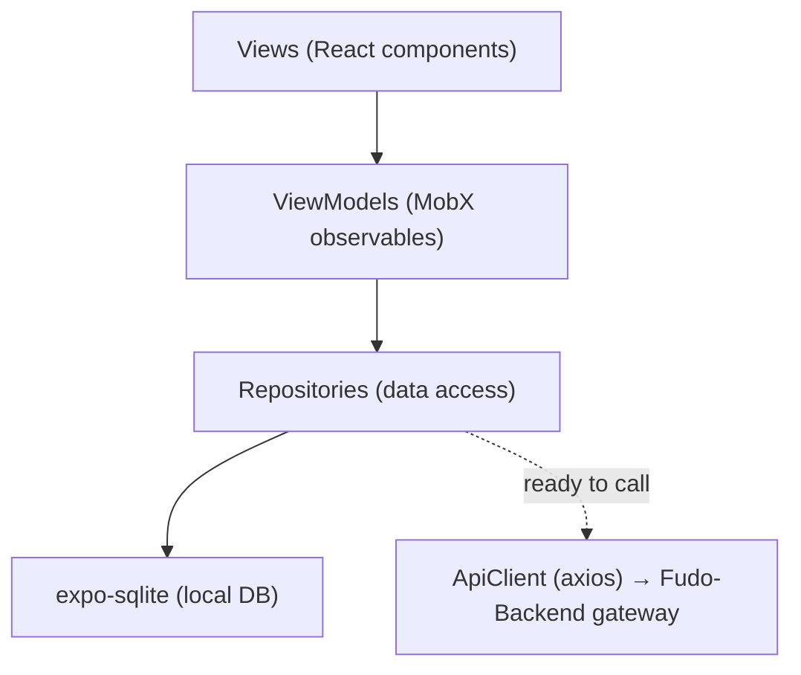

# Fudo — Food Recipe Social App

> ⚙️ **Backend:** [Fudo-Backend](https://github.com/QaisRjoob/Fudo-Backend) — the Spring Boot microservices API this app is designed to talk to.

A React Native + Expo app that works like Instagram, but for food recipes: posts, stories, direct messages, follows, and per-post analytics — with an offline-first, local-first architecture built on SQLite.

## Key features

- **Posts** — create, edit, delete multi-image/video posts with captions, ingredients, and steps
- **Stories** — 24-hour stories with replies, views, and highlights
- **Chat** — 1:1 conversations with text and media, edit/unsend messages
- **Social graph** — follow/unfollow, likes, comments, saves
- **Feed & Explore** — infinite scroll, pull-to-refresh, discover new creators
- **Profile & analytics** — impressions, views, saves, follower growth, per-period breakdowns
- **Offline-first** — full local persistence with background sync and optimistic updates

## Architecture

MVVM, with a repository layer that separates local persistence from (future) network calls:



Today the app is **local-first**: repositories read/write SQLite directly and the app is fully usable offline with seeded sample data. `src/api/client.ts` already has the axios client, auth-token interceptor, and `setBaseURL()` wired up — pointing it at a live [Fudo-Backend](https://github.com/QaisRjoob/Fudo-Backend) gateway and wiring repository methods to prefer the API (falling back to local cache) is the main remaining integration step.

### Folder structure

```
src/
├── models/          # TypeScript interfaces (User, Post, Message, etc.)
├── viewmodels/      # MobX ViewModels with observable state & actions
├── repositories/    # Data access layer (SQLite queries)
├── services/        # MediaService, StorageService, etc.
├── api/             # Axios client (ready for backend integration)
├── db/               # Database setup, migrations, seed data
└── utils/           # Helpers
app/                 # Expo Router screens
```

## Tech stack

- **Expo SDK 54** / **React Native 0.81**, **Expo Router** (file-based navigation)
- **TypeScript** (strict mode)
- **MobX** + **mobx-react-lite** for state
- **expo-sqlite** for local persistence, **expo-file-system** for media caching
- **axios** for the (not-yet-wired) backend client
- **Jest** + **@testing-library/react-native** for tests

## Getting started

### Locally

```bash
npm install
npx expo start
```

Then press `i` (iOS simulator), `a` (Android emulator), or scan the QR code with the [Expo Go](https://expo.dev/go) app on your phone.

On first launch the app initializes SQLite, runs migrations, and seeds sample data (5 users, 6 posts, active stories, conversations) so it's immediately explorable.

### With Docker

A `Dockerfile` is included that runs the Expo dev server (Metro bundler) in a container — useful for a consistent dev environment, not for producing an installable build:

```bash
docker build -t fudo-app .
docker run -p 8081:8081 -p 19000-19002:19000-19002 fudo-app
```

Connect from Expo Go or an emulator the same way as a local `expo start`. This does **not** replace [EAS Build](https://docs.expo.dev/build/introduction/) for producing a real APK/IPA — Docker can't do native mobile builds, only serve the JS bundle.

### Connecting to the backend

To point the app at a running [Fudo-Backend](https://github.com/QaisRjoob/Fudo-Backend) instance instead of local-only data:

```ts
import apiClient from './src/api/client';
apiClient.setBaseURL('http://localhost:5000'); // Fudo-Backend's gateway
```

- iOS simulator on the same machine → `http://localhost:5000` works as-is
- Android emulator → use `http://10.0.2.2:5000`
- Physical device → use your machine's LAN IP

## Testing

```bash
npm test
npm run test:coverage
```

Covers ViewModels, Repositories, and Services (`MediaService`, `StorageService`).

## Roadmap

- [ ] Wire repositories to prefer the live API with local-cache fallback
- [ ] Video upload and playback
- [ ] Story viewer with gestures, comment threads/replies
- [ ] Push notifications
- [ ] Recipe ingredient tagging, save collections/boards
- [ ] Dark mode, accessibility improvements
- [ ] Background upload queue with retry logic
